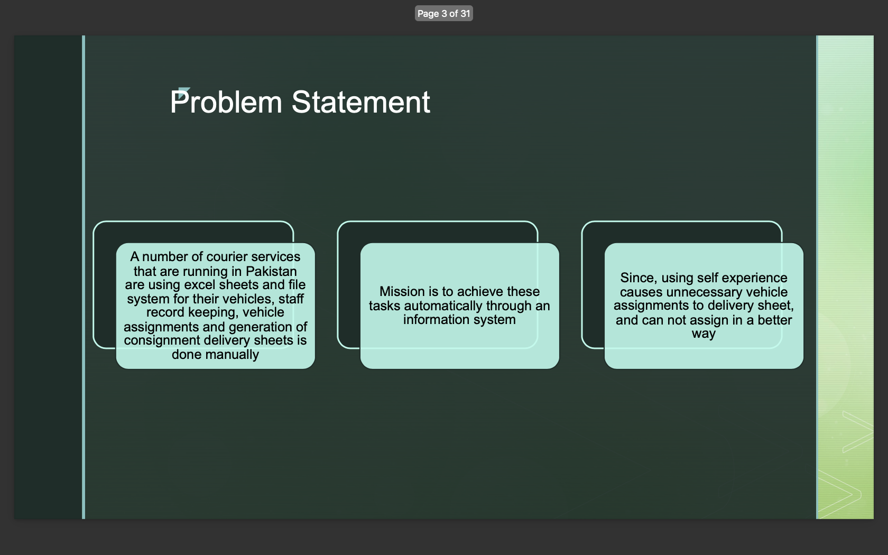
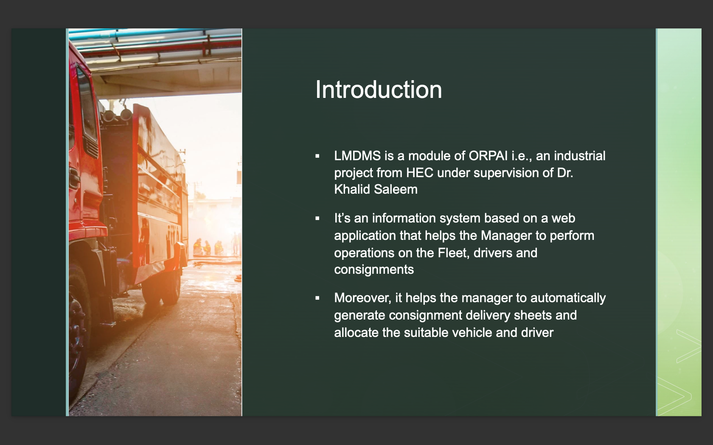
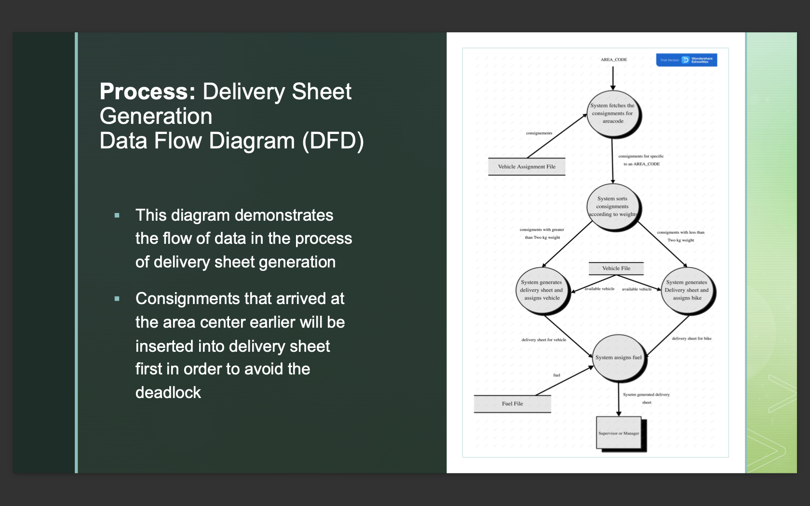
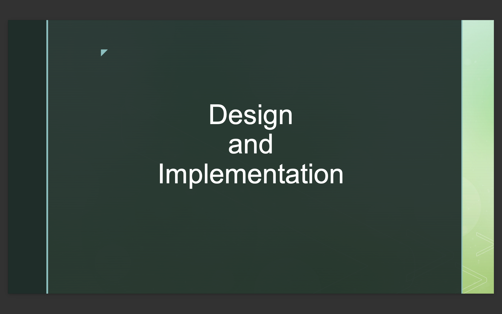

# Last Mile Delivery Management System (LMDMS)

**Presented By:** Syed Ahtsham Ul Hassan (04071813015)  
**Supervised By:** Dr. Khalid Saleem

## Introduction

The Last Mile Delivery Management System (LMDMS) is a module of the ORPAI project, funded by HEC and supervised by Dr. Khalid Saleem. This web-based information system streamlines and automates the management of fleet operations, driver assignments, and consignment deliveries for courier services. The project was designed to replace the manual systems currently used by courier services in Pakistan, such as TCS, which rely heavily on Excel sheets and manual record-keeping.

## Problem Statement

Many courier services in Pakistan manage their vehicles, staff records, and delivery sheet generation manually, leading to inefficiencies, unnecessary vehicle assignments, and suboptimal operations. The mission of LMDMS is to automate these tasks, providing a more efficient and error-free system for managing last-mile deliveries.

## Project Overview

LMDMS helps managers perform various operations on the fleet, drivers, and consignments. It automatically generates consignment delivery sheets, assigns suitable vehicles and drivers based on weight and volume considerations, and allows for better management of resources.

### Key Features:
- **Automated Delivery Sheet Generation:** Sorts consignments by area, weight, and volume before adding them to the delivery sheets.
- **Automatic Vehicle Assignment:** Assigns vehicles based on their capacity and current availability.
- **Driver Profile Management:** Allows drivers to view their assigned vehicles and delivery sheets.

## Proposed Solution

LMDMS automates the process of delivery sheet generation by sorting consignments according to their areas, weights, and volumes, and assigning them to the most suitable vehicle. The system also manages vehicle assignments, staff members, and drivers' profiles.

## Analysis

### Enhanced Entity-Relationship Diagram (EERD)
This diagram demonstrates the entities and their relationships within the system, focusing on operations with higher frequency.

### Use Case Diagram
This diagram illustrates the users/actors, functionalities/use cases of the application, and their relationships.

### Data Flow Diagrams (DFD)
- **Delivery Sheet Generation:** Demonstrates the flow of data during the generation of delivery sheets.
- **Vehicle Assignment:** Shows the flow of data in the process of vehicle assignment.

### Domain Model
Illustrates all the objects and their relationships within the LMDMS domain.

## Design and Implementation

### Class Diagram
Shows all the classes created in LMDMS along with their attributes and methods, including data types.

### Tools and Techniques
- **Laravel:** Chosen for its ease of use, support for MySQL, and the MVC design pattern, which is well-suited for a management system like LMDMS.

### Interfaces
The system includes multiple interfaces for managing vehicles, drivers, delivery sheets, and more.

### Performance Checking
LMDMS's performance was checked using Google Lighthouse to ensure it meets industry standards.

### SQL Queries
The system utilizes optimized SQL queries to handle large datasets efficiently.

## Future Enhancements

- **Fuel Management System:** To track and manage fuel usage.
- **Vehicle and Driver Inspection Management:** For regular inspections and maintenance.
- **Attendance and Accident Management:** To track driver attendance and manage accident reports.
- **Enhanced Search Filters:** To improve user experience with more refined search options.
- **Multi-Branch Extension:** To extend the application to manage multiple branches.

## Conclusion

LMDMS has successfully automated the processes of vehicle assignment and delivery sheet generation. It has significantly improved the management of vehicles, staff, and delivery sheets compared to the previous manual system.

## References

- Zave, P., Jackson, M., Gunter, E.L., & Gunter, C.A. (2000). A reference model for requirements and specifications. *IEEE Software, 17(3),* pp.37–43. doi:10.1109/52.896248.
- [IEEE.org](https://ieeexplore.ieee.org/). (2019).
- Design and implementation of outdoor and indoor campus navigation system. (2016). *International Journal of Modern Trends in Engineering & Research, 3(10),* pp.8–10. doi: 10.21884/ijmter.2016.3074.tttpf.

## Thank You

